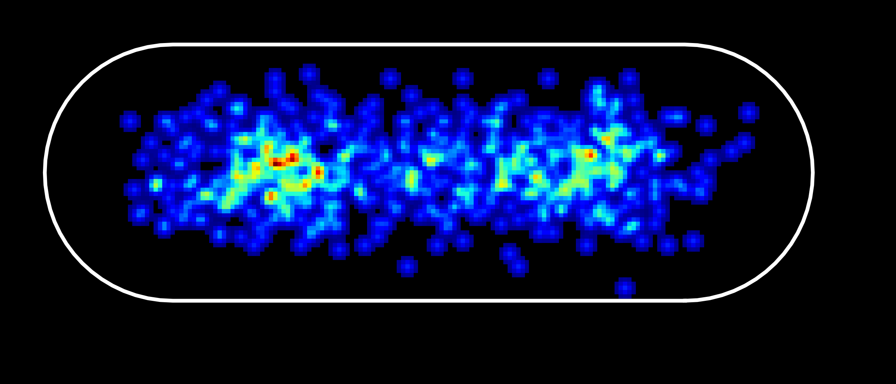

## BactFit

A package for fitting the shape of rod shaped bacterial cells to an ideal cell model. 
This is an analogue of colicoords, but using allowing cells to have multiple bends as the cell midline can be an N degree polynomial.

Once the cell model(s) have been generated, SMLM localisations can be transformed to an ideal cell model. 
This allows for the generation of heatmaps and cell renders that are representative of the cells in the dataset.

Bactfit is compatible with binary masks and Picasso localisation data, see examples. 
Bactfit Cells and CellLists can be saved/loaded from hdf5 files. 
Multiple CellLists can also be combined and saved as a single CellList.

BactFit has been integrated into **napari-moltrack** and **napari-bacseg**.

Author: Piers Turner, Kapanidis Group, University of Oxford.

## Installation

Create new conda environment (or venv) and activate it:

    conda create -name bactfit python=3.9
    conda activate bactfit

You can install `BactFit` via [pip]:

    pip install bactfit

To update `BactFit` to the latest version, use:

    pip install bactfit --upgrade

To install latest development version from [GitHub]:

    pip install git+https://github.com/piedrro/BactFit.git

## BactFit Algorithm

The cell models consist of polynomial midline and a cell radius. 
1) An initial midline is generated using a Voronoi diagram to the contour/outline of each cell. 
2) By buffering the midline using Shapely, a cell model is generated. 
3) This model is then optimised such that the directed hausdorff distance between the model and the cell contour/outline is minimised.

## BactFit Heatmap

The BactFit heatmap is generated by transforming the localisation coordinates to the ideal cell model. 
Heatmaps can be generated if the localisations include X and Y coordinates. 
This heatmap was made from 700 localisations originating from 800 cells, see example. 

## BactFit Cell Render

The BactFit cell render is generated by transforming the localisation coordinates to the ideal cell model.
Heatmaps can be generated using Picasso SMLM rendering so must include Picasso fit metrics alongside X and Y coordinates.
This render was made from 700 localisations originating from 800 cells, see example.

